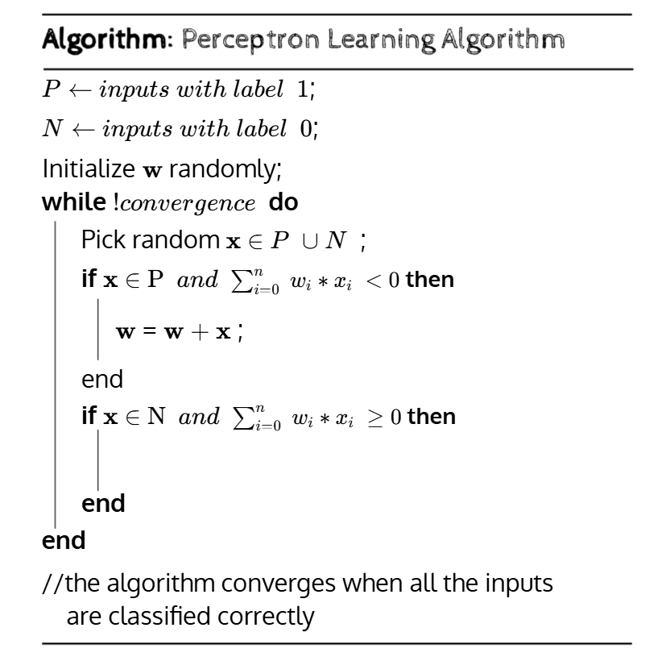

# Single Perceptron Model

A simplistic implementation of single perceptron, trainable with Perceptron Learning Aglorithm (PLA).
This is a very basic implementation which uses primitive _(Heaviside)_ step activation function and a very simple loss function.

<div align="center">

![Jupyter][jupyter-shield]
![NumPy][numpy-shield]
![Pandas][pandas-shield]

</div>

<div align="center">

![Visitors][visitors-shield]

</div>

## Explaination

The perceptron implemention follows the explaination from the [CS6910/CS7015 - Deep Learning Course](https://www.cse.iitm.ac.in/~miteshk/CS6910.html) lectures _(L1, L2)_ by [Prof. Mitesh M. Khapra](https://www.cse.iitm.ac.in/~miteshk/)

I recommend checking out his lectures!

### Dataset

Since, using a single perceptron it is possible to represent linearly separable functions, we use examples from our boolean world which are linearly separable except for the `XOR` and `XNOR` datasets which are not linearly separable!

### Algorithm



Above is the (rough) mathematical representation of the algorithm. [Reference](https://iitm-pod.slides.com/arunprakash_ai/cs6910-lecture-2/fullscreen#/0/36/8)

In essense,  
To represent / learn a linearly separable function with _2_ boolean input features and _1_ boolean output.  
We can ...

### 1. Initialization: Weights and the Bias Term

In the formula of the weighted sum i.e. ($\sum_{i=0}^{n} w_i * x_i$), the sum starts from $i=0$. This $i=0$ term
represents the **bias** (or threshold).

We define set `P` as all the inputs in the dataset for which the expected output is **1** and vice-versa as the set `N`.

Thus,

- **Input Vector `x`:** To account for the bias, we augment our input vector. Instead of $[x_1, x_2]$, it becomes $x = [x_0, x_1, x_2]$, where **$x_0$ is always 1**.
- **Weights Vector `w`:** This vector will therefore have 3 corresponding weights: $w = [w_0, w_1, w_2]$.
- **Initialization:** We initialize `w` randomly. For example, `w` could start as `[0, 0, 0]` or small random values.

The term $w_0$ (the bias) is crucial. It allows the separating line to not have to pass through the origin (0,0), making it possible to solve problems like a simple AND gate.

---

### 2. The Learning Loop: Iterating and Updating

The algorithm now enters the `while !convergence` loop. In each iteration, it does the following:

#### Step 1: Pick an Input

It picks one random input vector `x` from the entire dataset (`P` $\cup$ `N`).

#### Step 2: Make a Prediction

It calculates the **weighted sum**, also called the _activation_ or _net input_. Let's call it $a$:

$$a = \sum_{i=0}^{n} w_i * x_i = \mathbf{w} \cdot \mathbf{x}$$

In our 2-input case, this is:
$a = (w_0 * x_0) + (w_1 * x_1) + (w_2 * x_2)$
Since $x_0 = 1$, this simplifies to:
$a = w_0 + w_1*x_1 + w_2*x_2$

The perceptron's prediction rule is simple:

- If $a \ge 0$, it predicts **1** (positive class).
- If $a < 0$, it predicts **0** (negative class).

This rule is essentially the **heaviside step** activation function which has a harsh separating threshold.

#### Step 3: Check for Errors and Update

This is the core of the algorithm. It checks if the prediction from Step 2 was wrong.

**Case 1: A False Negative (Type 1 Error)**

- **Check:** `if x ∈ P and a < 0 then`
- **Meaning:** The true label is **1** (it's in `P`), but the algorithm predicted **0** (because the sum $a$ was negative). This is an error.
- **Update Rule:** `w = w + x`
- **Why?** By adding the input vector `x` to the weights `w`, we are "nudging" the weight vector to be more similar to `x`. This makes it more likely that the dot product $\mathbf{w} \cdot \mathbf{x}$ will be positive the next time this input is seen.

**Case 2: A False Positive (Type 2 Error)**

- **Check:** `if x ∈ N and a ≥ 0 then`
- **Meaning:** The true label is **0** (it's in `N`), but the algorithm predicted **1** (because the sum $a$ was zero or positive). This is also an error.
- **Update Rule:** `w = w - x`
- **Why?** By _subtracting_ the input vector `x` from the weights `w`, we are "pushing" the weight vector away from `x`. This makes it more likely that the dot product $\mathbf{w} \cdot \mathbf{x}$ will be negative the next time.

If the picked input `x` is classified correctly (i.e., it's in `P` and $a \ge 0$, or it's in `N` and $a < 0$), **no update is made**, and the algorithm moves to the next iteration.

---

### 3. Convergence

The loop continues this process of picking a random point, checking for an error, and updating the weights _if an error is made_.

**Convergence** is achieved when the algorithm can pass through the _entire_ dataset, one input at a time, and make **zero corrections**. This means:

- Every input `x` in `P` results in a weighted sum $a \ge 0$.
- Every input `x` in `N` results in a weighted sum $a < 0$.

Once this happens, the loop condition `!convergence` becomes false, and the algorithm terminates. The final vector `w` now defines the parameters of a line ($w_0 + w_1*x_1 + w_2*x_2 = 0$) that perfectly separates the positive and negative data points.

This convergence is only guaranteed if the dataset is **linearly separable** (meaning such a line actually exists).

## Requirements

- [matplotlib](https://pypi.org/project/matplotlib/)
- [numpy](https://pypi.org/project/numpy/)
- [pandas](https://pypi.org/project/pandas/)

## Setup

```bash
pip install -r requirements.txt
```

## Train

```bash
python train.py --data_path data/*.csv --epochs 15 --model_path saved_models/* --verbose
```

## Test

```bash
python test.py --data_path data/*.csv --model_path saved_models/*
```

<!-- MARKDOWN SHIELDS -->

[jupyter-shield]: https://img.shields.io/badge/Jupyter-informtional?style=flat-square&logo=jupyter&labelColor=white&color=%23F37626&link=https%3A%2F%2Fpypi.org%2Fproject%2Fjupyter%2F
[numpy-shield]: https://img.shields.io/badge/NumPy-informtional?style=flat-square&logo=numpy&labelColor=%23013243&color=white&link=https%3A%2F%2Fpypi.org%2Fproject%2Fnumpy%2F
[pandas-shield]: https://img.shields.io/badge/Pandas-informtional?style=flat-square&logo=pandas&labelColor=%23150458&color=white&link=https%3A%2F%2Fpypi.org%2Fproject%2Fpandas%2F
[visitors-shield]: https://visitor-badge.laobi.icu/badge?page_id=dashaikh10.perceptron
